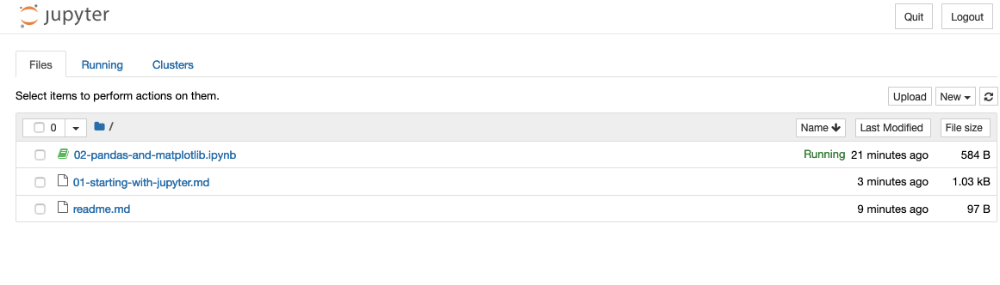

# Getting Started With Jupyter

Getting started with Jupyter should be easy if you've already been using `pipenv`, or if you're comfortable installing Jupyter globally using `pip`. If you're not familiar with `pipenv` go to the main readme for this repo and read the installation instructions there.

First, activate a `pipenv` environment shell from any directory in this repo:

```
cd /path/to/learn-to-code-python # Note, your path will be different...
pipenv shell
```

Then, activate Jupyter notebook from the directory containing this file:

```
jupyter notebook
```

A browser window should open automatically on a page that looks something like this:



### Danger Zone

If you don't want to install `pipenv` and you don't mind polluting your main Python path by installing Jupyter globally you can simply:

```
pip install jupyter
jupyter notebook
```

Going this route can cause confusing bugs later down the road related to your environment. E.g. someone will be using a different version of Jupyter than you, and the code will only work on their machine even though it's actually the same...

For more about why a virtual environment (such as `pipenv`) is a good idea, read this: [https://realpython.com/python-virtual-environments-a-primer/](https://realpython.com/python-virtual-environments-a-primer/)