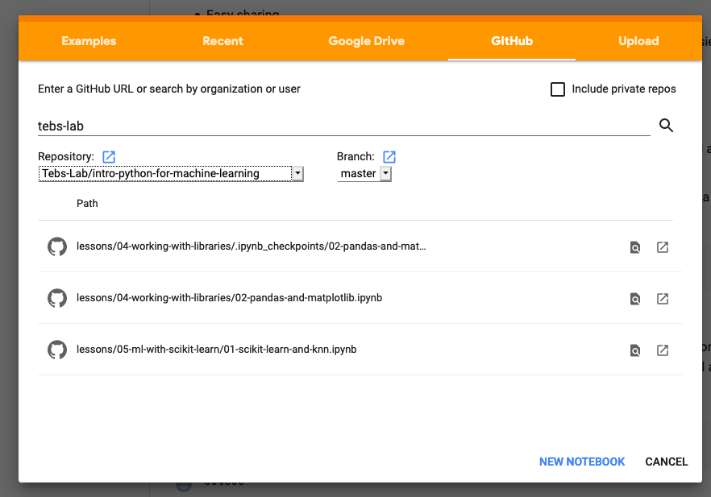

# Learn Python For Analytics, AI, and Machine Learning

This class is targeted at aspiring programmers who are learning their first programming language. It may be appropriate for programmers who currently at beginner-intermediate level in another programming language, and want to get a jump start in learning Python. Such students will also clarify their understanding of what aspects of programming languages are broadly shared among languages, and which are idiosyncratic to whatever language they already speak.

For more information about the content and progression of the course, see [the outline](outline.md).

## Using The Code Samples

To run the python examples and notebooks, you'll need to have Python3 and pipenv installed. Instructions for installing Pipenv can be found [at this link](https://pipenv.pypa.io/en/latest/install/#installing-pipenv). Most computers come with a version of Python3 already installed, but if yours does not you may [follow these instructions](https://realpython.com/installing-python/). Once you have installed Python3 and Pipenv navigate to the main repo folder and run the following commands:

```
pipenv install
pipenv shell
```

Most of the examples can be run via an IDE or directly in the terminal, however there are a few examples that require Jupyter Notebooks. These are part of the dependencies that will be installed via `pipenv`, but you can also run them on Google Colab if you prefer. 

### Using Colab For The Jupyter Notebooks

Google Colab has options to open Jupyter Notebooks directly from Github. When you land on the Colab homepage a box with a gold/orange navigational header will appear, click the "Github" link and type "tebs-lab" into the provided search bar, then in the drop-down menu select this repository, "intro-python-for-machine-learning".



A list of all the notebooks in this repo should appear. Select the one you wish to open and you should be off to the races.

The Colab approach has a handful of downsides. First, for some of the examples require dependencies that are not supported out of the box on Colab. There are [ways to add these dependencies to a Colab instance](https://cloud.google.com/datalab/docs/how-to/adding-libraries), but it is not always straightforward to do so.

Secondly, some of the notebooks require external data sets that, for either size or licensing reasons, cannot be included in this repository itself. In those cases we have tried to leave clear instructions on how to obtain the relevant datasets and other resources. Data wrangling is a very real part of work as a machine learning practitioner, and we believe these exercises to be valuable practice. Again, it is [possible to upload this data into Colab](https://cloud.google.com/datalab/docs/how-to/adding-libraries) but not as easy as running the labs locally.

If you have a computer without much processing power, Colab is a good way to leverage Google's computational resources to get better performance and decrease training time.

### Less Recommended But Viable Alternatives to Pipenv

While we love and recommend `pipenv`, a more standard requirements.txt file is provided for those who want to manage their virtual environments with something other than `pipenv` or simply install the requirements globally to their user. **Although this is not recommended, you can simply install the requirements globally using the following command**:

```
pip install -r requirements.txt
```

Similarly, if you are already familiar with another Python version/package manager such as Anaconda, `virtualenv`, or something else you may use this to install the dependencies for the provided examples.

## Running or Taking A Class

This course is organized as a series of lessons. You should read the [outline](outline.md) to get an idea of the course arc. Additionally, each lesson consists of a series of examples, an exercise, and some suggested reading material. You can find the objectives and reading suggestions in each lessons readme file (for example, [navigate here](lessons/01-the-big-picture) to see lesson one's readme). The examples that drive that class and exercise for students to attempt is also contained in each lessons directory.

Students should attempt the reading before each class. The instructor should work though the examples with the students during each class session, leaving some time at the end for students to begin work on the exercise. Students should expect to spend some time working on the exercise on their own. 

At the start of each class, review the exercise with the students. Ask the students to share their work collaboratively and address lingering confusion and questions at the start of each session.

## Support Teb's Lab

These materials were created by [Tyler Bettilyon](https://www.linkedin.com/in/tylerbettilyon/) and [Teb's Lab](https://tebs-lab.com). You can support the creation of more free, open source, public domain educational materials by sharing them with others, [subscribing to our newsletter](http://eepurl.com/dum8IP) or becoming a subscriber on [Patreon](https://www.patreon.com/tebsLab).